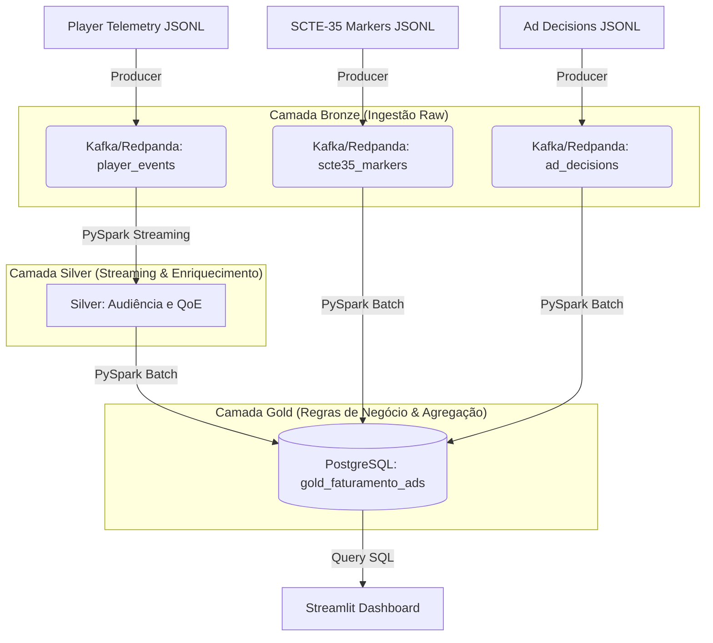

# 🏟️ Operação Maracanã - Solução de Engenharia de Dados
**Candidato:** 

Este repositório contém a solução completa para o desafio técnico "Operação Maracanã", com o objetivo de suportar altíssima volumetria (picos de milhões de acessos) com cálculos exatos de audiência, QoE (Quality of Experience) e reconciliação de faturamento de anúncios (SCTE-35).

**📊 Dashboard em produção:** [desafio-data-engineer-globo.streamlit.app](https://desafio-data-engineer-globo.streamlit.app) — versão em nuvem, sem necessidade de subir nada localmente. Detalhes do deploy no [README.md](./README.md#deploy-no-streamlit-cloud).

---

## 🚀 Como Executar o Projeto (How to Run)

Este pipeline foi construído para rodar localmente utilizando Docker para infraestrutura e PySpark para o processamento de dados. 

**Pré-requisitos:** Python 3.12+, Docker e Docker Compose.

**1. Subir a Infraestrutura Base (Kafka/PostgreSQL)**
```bash
docker-compose up -d
```

**2. Gerar os Dados Sintéticos**
```bash
python generate_all.py --n-sessions 2000
```

**3. Executar o Pipeline PySpark (Medallion Architecture)**
```bash
# Ingestão e Validação de Contrato
python jobs/bronze/producer.py

# Processamento Streaming e QoE (Deixe rodando em um terminal)
python jobs/silver/streaming.py

# Reconciliação Financeira Batch (Rode em um novo terminal)
python jobs/gold/batch_gold.py
```

**4. Visualizar o Dashboard de Negócios (Streamlit) — versão local**
```bash
streamlit run app/app.py
```
> 💡 Versão em nuvem disponível em [desafio-data-engineer-globo.streamlit.app](https://desafio-data-engineer-globo.streamlit.app), sem necessidade de rodar o passo acima.

---

## 🏛️ Arquitetura e Design Técnico (Medallion)

O fluxo de dados foi desenhado em três camadas, combinando processamento *Streaming* (tempo real) e *Batch* (lote) utilizando **Apache Spark / PySpark**.



### 1. Camada Bronze (Ingestão e Governança)
* **Objetivo:** Ingestão bruta, validação de contratos e armazenamento otimizado.
* **Schema Evolution:** Sistema preparado para a `v2` dos eventos (coluna `network_type`). O schema garante retrocompatibilidade (BACKWARD) sem quebrar o pipeline.
* **Storage:** Dados validados são salvos particionados em **Parquet**, reduzindo I/O para leituras analíticas.

### 2. Camada Silver (Streaming, QoE e Marcadores)
* **Objetivo:** Calcular o CCV e métricas de qualidade (buffer, error_rate) em janelas de 1 minuto cruzando com os marcadores SCTE-35.
* **Idempotência (Exactly-Once):** Como a rede gera duplicatas (~1%), aplicamos `dropDuplicates(["event_id", "timestamp"])` na telemetria, garantindo que o evento seja contado apenas uma vez.
* **Lateness & Watermarks:** Aplicamos um atraso tolerável (*Watermark*) de 15 segundos nos streams, retendo os dados na memória de forma segura (lidando com *clock skew* e *out-of-order*).
* **Escalabilidade do CCV (HyperLogLog):** Em vez do `COUNT DISTINCT` clássico (que explodiria a RAM para milhões de usuários), implementamos `approx_count_distinct()`, permitindo o cálculo do pico de audiência com um *footprint* mínimo de memória.

### 3. Camada Gold (Batch e Inteligência Financeira)
* **Objetivo:** Reconciliar a audiência Silver com os metadados do conteúdo e o *Ad Server* gerando o faturamento executivo.
* **Resolução de Fan-Out:** Durante o cruzamento com a tabela de anúncios, aplicamos `TRIM()` para higienização dos IDs e isolamos a receita máxima por anúncio utilizando uma CTE (*Common Table Expression*), prevenindo a multiplicação indevida de receita.

---

## 🛡️ Governança, Qualidade de Dados (QA) e LGPD

### Qualidade de Dados (Fail-Fast & Auditoria)
Foram implementados **6 checks de Data Quality** nativos no PySpark:
* **Runtime (Silver):** Validação em tempo real verificando *Volume* (lotes vazios) e *Schema/Completeness* (impedindo a passagem de colunas críticas nulas, como `cdn` e `window_start`). Em caso de falha, aciona um *circuit breaker* (`ValueError`).
* **Batch (Gold):** Auditoria pós-processamento validando *Distribution* (faturamento e audiência não negativos), *Completeness* (patrocinadores válidos) e *Freshness*.

### Conformidade com a LGPD
1. **Separação de Domínios:** O sistema Ad Decisions recebe apenas um `user_id_anon` (mascarado), sem ligação direta com os dados do cliente.
2. **Minimização de Dados:** Na transição da Bronze para a Silver, dados de IP e geolocalização exata não são propagados em nível individual. Nenhuma identificação pessoal (PII) chega à Camada Gold.
3. **Cruzamento Indireto:** A reconciliação multi-source para o faturamento não utiliza chaves de usuário, operando via identificadores de marcadores de vídeo (`marker_id`).

---

## 📊 Validação de Negócio e Anomalias (Resultados Analíticos)

### Faturamento Total por Anunciante (Reconciliação Gold)
Através da CTE com agregação de valor máximo, contornamos o problema de *Fan-Out* em joins de granularidade mista e chegamos ao faturamento real:

| Patrocinador | Programa | Faturamento Total | Espectadores Impactados |
| :--- | :--- | :--- | :--- |
| **Coca-Cola** | Final do Brasileirão 2026 | R$ 806,56 | 3.230 |
| **TIM Brasil** | Final do Brasileirão 2026 | R$ 175,23 | 1.181 |
| **Volkswagen** | Final do Brasileirão 2026 | R$ 95,16 | 212 |

### Alerta de Degradação (Burst em CDN-B)
A lógica da Camada Silver detectou com sucesso o *burst* de anomalia injetado na **CDN-B**. Durante a janela de crise, a CDN-B registrou taxas de erro médias de até **6.52%** e tempos de buffer acima de **13.000 ms**, enquanto outras CDNs operavam com 0% de erro.

### Pico Real de Audiência (Max CCV)
A estratégia de remoção de duplicatas somada ao agrupamento com *HyperLogLog* identificou que o pico máximo de audiência simultânea atingiu **2.245 espectadores simultâneos** no minuto `19:47` da transmissão. 

---

## 🤖 Declaração de Transparência (Uso de IA)
Conforme solicitado na Fase 5 do desafio, declaro o uso de assistentes de Inteligência Artificial (Copilot / Gemini) durante o desenvolvimento deste projeto. 
* **Onde a IA foi utilizada:** Geração de *boilerplate* de código, UI do Streamlit, refatoração estrutural de diretórios, e revisão de sintaxe de documentação.
* **Onde a IA NÃO tomou decisões:** A modelagem arquitetural (Medallion), a escolha de algoritmos de otimização (HyperLogLog), as estratégias de retenção de estado em *streaming* (*Watermarks*), e a lógica matemática para resolução de anomalias financeiras (*Fan-Out* em CTEs) foram decisões exclusivas de engenharia humana.

---

# Geradores sintéticos — "Operação Maracanã" (Contexto Original do Desafio)

Geradores para os quatro datasets do desafio. Saída em JSON Lines, determinística por seed.

## TL;DR

```bash
# 1) Clonar o repo, entrar na pasta deste README.
# 2) (Opcional) instalar extras: pip install -r requirements.txt
# 3) Rodar:
python generate_all.py                       # default: 2000 sessões, ~30s
python generate_all.py --n-sessions 500      # rápido, ~5s
python generate_all.py --only scte35 content # só metadados, segundos
```

Saída em `data/raw/`:

| Arquivo | Conteúdo | Volume típico (2k sessões) |
|---|---|---|
| `player_events.jsonl`     | Stream A — telemetria de player    | ~525k linhas / ~260 MB |
| `scte35_markers.jsonl`    | Stream B — cue tones SCTE-35       | ~10 linhas / <1 KB |
| `content_metadata.jsonl`  | Dataset C — catálogo (SCD)          | ~51 linhas / ~20 KB |
| `content_metadata.parquet` | (se pyarrow instalado)              | ~51 linhas / ~10 KB |
| `ad_decisions.jsonl`      | Dataset D — impressões de ad (bônus) | ~30-80k linhas / ~10-25 MB |

## Injeções deliberadas (NÃO remova!)

Estas anomalias são o ponto pedagógico do desafio. O candidato precisa lidar com elas explicitamente — são as razões pelas quais SLOs de freshness/exactly-once/schema evolution existem.

| # | Injeção | Default | O que testar |
|---|---|---|---|
| (i)   | **Out-of-order** em até 15 s | 100% — sempre embaralhado em frames | watermarks, allowed lateness, side outputs |
| (ii)  | **Duplicatas** (mesmo `event_id`) | ~1% | dedupe idempotente, exactly-once |
| (iii) | **Schema v2** com `network_type` | ~0.5% | compat BACKWARD, default values, registry |
| (iv)  | **Burst em cdn-b** [min 60-75] | error rate ~50x, buffer rate ~9x | detecção de anomalia, alerta multi-burn-rate |
| (v)   | **Clock skew** por device | ±5 s consistente por device | event-time vs ingestion-time, watermarks |

Validação rápida das injeções:

```bash
python <<'EOF'
import json
from collections import Counter
events = [json.loads(l) for l in open("data/raw/player_events.jsonl")]
ids = Counter(e["event_id"] for e in events)
print(f"events: {len(events):,}")
print(f"dupes:  {sum(1 for c in ids.values() if c > 1):,}")
print(f"v2:     {sum(1 for e in events if 'network_type' in e):,}")
EOF
```

## Parametrização

Edite `config/config.yaml` ou use flags de CLI (CLI tem precedência):

```bash
python generate_all.py --n-sessions 10000 --seed 7 --output-dir /tmp/maracana
python generate_all.py --only player --n-sessions 500
python generate_all.py --skip ads        # pula o dataset bônus
python generate_all.py --config config/alt.yaml # config alternativo
```